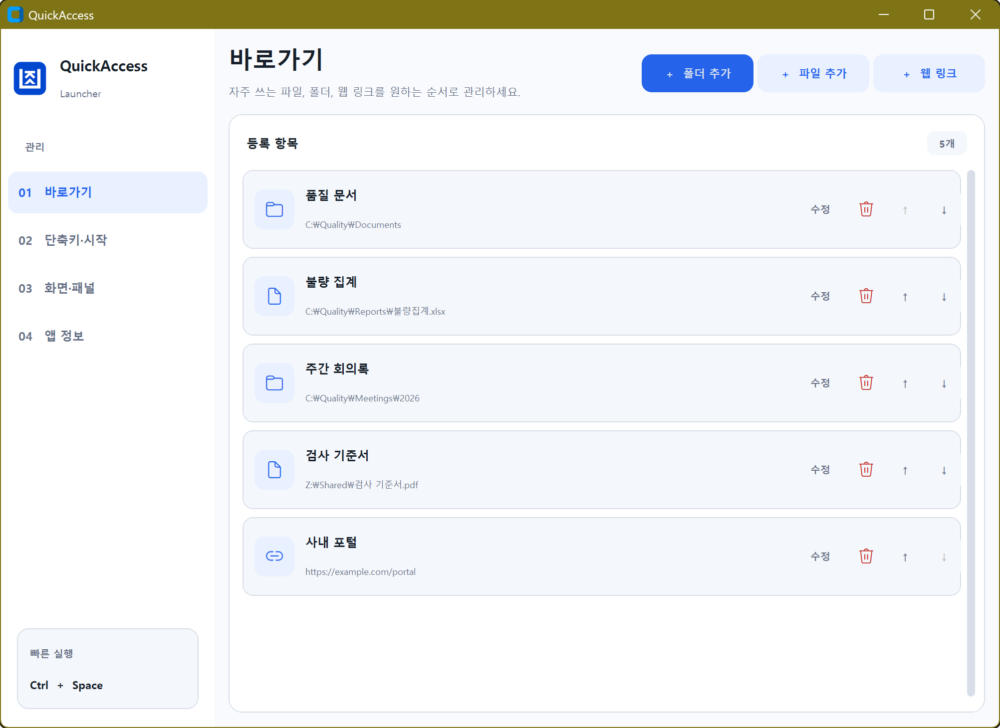

# QuickAccess Launcher

전역 핫키로 마우스 커서 위치에 버튼 패널을 띄우고, 자주 쓰는 Windows
폴더와 파일을 한 번의 클릭으로 여는 상주형 런처입니다.

## 다운로드

[GitHub Releases](https://github.com/Daksle-number-13/quickaccess-launcher/releases)에서
`QuickAccess.exe`를 다운로드하면 별도의 Python 설치 없이 바로 실행할 수
있습니다. Windows 10/11 x64를 지원합니다.

릴리스 바이너리의 Authenticode 서명은
[SignPath Foundation](https://signpath.org/)의 무료 오픈소스 코드 서명 프로그램을
사용하도록 자동화되어 있습니다. SignPath 승인 전에 게시된 바이너리는
미서명 상태일 수 있으므로 각 Release의 서명 안내를 확인하세요.

### Code signing policy

- Free code signing provided by [SignPath.io](https://signpath.io/), certificate by
  [SignPath Foundation](https://signpath.org/).
- Committer and reviewer: [Daksle](https://github.com/Daksle-number-13)
- Approver: [Daksle](https://github.com/Daksle-number-13)
- Signed release artifacts are built from this public repository by GitHub Actions.
- Privacy: This program will not transfer any information to other networked systems
  unless specifically requested by the user or the person installing or operating it.

## 동작 화면

`Ctrl+Space`를 누르면 마우스 커서가 있는 모니터에 빠른 실행 패널이 즉시
표시됩니다. 정상 경로는 한 번의 클릭으로 열고, 찾을 수 없는 경로는 같은
카드에서 바로 재지정할 수 있습니다.


환경 설정에서는 화면 스타일, 패널 열 수, 전역 단축키와 Windows 자동 실행을
한곳에서 변경할 수 있습니다.



## 주요 기능

- `Ctrl+Space`: 커서가 있는 모니터의 작업 영역 안에 런처 패널 표시
- `Ctrl+Shift+Space`: 현재 활성화된 파일 탐색기의 선택 항목 또는 폴더 등록
- 파일·폴더 추가, 이름 수정, 삭제, `▲/▼` 고정 순서 변경
- 시스템/밝게/어둡게 화면 스타일, 2~5열 격자, 두 전역 핫키 변경
- 누락되거나 응답이 느린 경로를 회색 `!` 버튼으로 표시하고 즉시 재지정
- 시스템 트레이 메뉴: `패널 열기`, `설정`, `종료`
- 사용자별 자동 실행, 단일 인스턴스, 한글 경로 및 UTF-8 JSON 지원
- Windows 11 계열 카드 UI, 저장되는 밝기 모드, 혼합 DPI 모니터 대응
- 설정 저장 위치: `%APPDATA%\QuickAccess\items.json`
- 로그 위치: `%LOCALAPPDATA%\QuickAccess\logs\quickaccess.log`

키보드 전체를 후킹하는 라이브러리 대신 Windows 공식 `RegisterHotKey` API를
사용합니다. 관리자 권한은 필요하지 않습니다.

## 개발 환경 실행

지원 환경은 Windows 10/11 x64와 Python 3.11 이상입니다.

```powershell
python -m pip install -r requirements-dev.txt
python main.py
```

실행하면 일반 창은 뜨지 않고 시스템 트레이에 상주합니다. 첫 실행 시 다음
기본 항목이 생성됩니다.

- 현재 사용자의 `Downloads`
- 현재 사용자의 `Documents`

명세에 맞춰 부팅 시 자동 실행 기본값은 켜져 있습니다. 원하지 않으면 트레이
아이콘을 우클릭하고 `설정`에서 끌 수 있습니다. 회사 정책이 레지스트리 등록을
막으면 앱은 설정을 자동으로 끈 상태로 되돌리고 알림을 표시합니다.

## 사용법

1. `Ctrl+Space`를 누릅니다.
2. 원하는 버튼을 클릭합니다.
3. 항목 관리는 패널 우측 아래 `⚙ 설정` 또는 트레이의 `설정`에서 합니다.

탐색기 빠른 등록은 등록할 파일이나 폴더가 보이는 탐색기를 먼저 활성화한 뒤
`Ctrl+Shift+Space`를 누릅니다. 선택된 항목이 있으면 첫 번째 항목을, 없으면
현재 폴더를 등록합니다. Quick Access, 내 PC 등 실제 파일시스템 경로가 아닌
가상 위치는 등록하지 않습니다.

`Ctrl+Space`가 IME, IDE 또는 사내 프로그램과 충돌하면 설정에서 두 핫키를
변경할 수 있습니다. 새 조합을 Windows에 등록하지 못하면 기존 핫키가 유지되고
JSON도 변경되지 않습니다.

환경 설정의 `화면 스타일`에서 Windows 설정을 따르는 `시스템`, 항상 밝은
`밝게`, 항상 어두운 `어둡게` 중 하나를 선택할 수 있습니다. 선택값은 즉시
적용되고 다음 실행에도 유지됩니다.

## 테스트

```powershell
python -m pytest -q -p no:cacheprovider
python -m compileall -q main.py quickaccess tests
python -m pip check
python main.py --smoke-test
```

자동 테스트는 데이터 마이그레이션·원자 저장·손상 복구·고정 순서·핫키 파싱과
롤백·작업 영역 경계 보정·경로 검사 타임아웃과 오래된 결과 무시·탐색기 COM
선택 정책·트레이 큐·시작프로그램 명령·단일 인스턴스·실제 Tk 토스트 생성 등을
검사합니다.

## 단일 EXE 빌드

```powershell
.\build.ps1 -Clean -PythonExecutable C:\path\to\python.exe
```

산출물은 `dist\QuickAccess.exe`입니다. `quickaccess.spec`는 CustomTkinter의
테마·폰트와 pystray/pywin32 동적 모듈을 명시적으로 수집하고, UPX를 사용하지
않는 one-file/windowed 빌드입니다.

릴리스 빌드는 보안 수정이 포함된 Python 3.13.15 이상을 요구합니다. 일반 소스
실행의 최소 버전은 Python 3.11이지만, 구 Python 런타임이 EXE에 포함되지 않도록
빌드 스크립트가 릴리스 인터프리터 버전을 검사합니다.

> CustomTkinter의 공식 권장 배포 방식은 onedir입니다. 이 프로젝트는 제품
> 요구사항 때문에 모든 리소스를 수집하는 one-file 사양을 사용합니다. 최종
> 배포 전 반드시 Python이 없는 깨끗한 Windows PC에서 EXE를 검증하세요.

빌드 머신에서 트레이·핫키·Tk 초기화를 짧게 점검하고 자동 종료하려면 다음을
실행합니다. one-file 압축 해제가 끝난 뒤 자동 종료되며, 임시 설정을 사용하므로
실제 JSON이나 시작프로그램 레지스트리는 변경하지 않습니다.

```powershell
.\dist\QuickAccess.exe --smoke-test
```

회사 코드 서명 인증서가 Windows 인증서 저장소의 `My`에 설치되어 있고 Windows
SDK Signing Tools를 사용할 수 있으면, 빌드 후 다음 명령으로 SHA-256
Authenticode 서명과 RFC 3161 타임스탬프를 적용합니다.

```powershell
.\sign.ps1 `
  -CertificateThumbprint YOUR_CODE_SIGNING_CERT_THUMBPRINT `
  -TimestampServer https://YOUR_CA_RFC3161_TIMESTAMP_SERVER
```

스크립트는 Code Signing EKU, 개인 키, 유효기간, 서명 상태와 타임스탬프를 모두
검증합니다. 서명하면 파일 해시가 바뀌므로 서명된 동일 파일로 스모크 테스트와
SHA-256 기록을 다시 수행해야 합니다.

## 실제 환경 릴리스 체크리스트

- Windows 10/11, 표준 사용자 계정, 한글 Windows 사용자명에서 실행
- 100/125/150/200% 혼합 DPI 및 음수 좌표 멀티모니터에서 네 모서리 보정
- 회사 EDR/백신에서 `RegisterHotKey` 및 미서명 PyInstaller EXE 허용 여부
- 최종 EXE에 회사 Authenticode 인증서로 서명하고 타임스탬프 적용
- `Ctrl+Space`와 한/영 전환, IDE 자동완성, 업무 앱 단축키 충돌 여부
- Windows 11 탐색기 탭, 검색 결과, OneDrive, UNC/네트워크 경로 빠른 등록
- 부팅 자동 실행, 동시 두 번 실행, 탐색기 재시작, 종료 후 잔류 프로세스
- 느리거나 연결이 끊긴 네트워크 경로가 UI와 종료를 막지 않는지 확인

Python 스레드에서는 진행 중인 네트워크 파일시스템 호출을 강제 종료할 수
없습니다. 따라서 경로 검사는 2초 후 UI 상태를 `timeout`으로 확정하고, 늦게
끝난 결과는 무시하는 데몬 작업으로 격리합니다.

## 프로젝트 구조

```text
quickaccess/
├── app.py                 # Tk 메인 스레드 컨트롤러
├── commands.py            # 백그라운드 → UI 명령 큐
├── models.py              # 설정 및 항목 도메인 모델
├── storage.py             # UTF-8 JSON 원자 저장/복구
├── ui/                    # 팝업, 설정창, 입력/토스트
└── services/              # 핫키, 트레이, COM, 검사, 레지스트리 등
tests/                     # 자동 단위 및 서비스 테스트
quickaccess.spec           # 단일 EXE PyInstaller 구성
```

## 라이선스

[MIT License](LICENSE)
